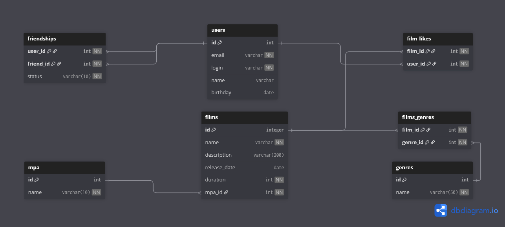

## ER-диаграмма базы данных




### Пояснение
- `users` — пользователи (email и login — уникальные).
- `films` — фильмы (обязательные: name, duration, mpa_id).
- `mpa` — справочник рейтингов.
- `genres` + `film_genres` — жанры. связь многие-ко-многим.
- `film_likes` — лайки пользователя к фильму (уникальная пара film_id+user_id).
- `friendships` — дружба со статусом (`PENDING`/`CONFIRMED`), уникальная пара user_id+friend_id.

### Примеры запросов

**1) Все фильмы**
```sql
SELECT id, name, description, release_date, duration, mpa_id
FROM films;
```
**2) Топ N популярных фильмов по количеству лайков**
```sql
SELECT f.id, f.name, COUNT(fl.user_id) AS likes
FROM films f
LEFT JOIN film_likes fl ON fl.film_id = f.id
GROUP BY f.id, f.name
ORDER BY likes DESC, f.name ASC
LIMIT 10; -- N
```
**3) Список общих друзей с другим пользователем(подтвержденные)**
```sql
SELECT u.id, u.login
FROM friendships f1
JOIN friendships f2 ON f1.friend_id = f2.friend_id
JOIN users u ON u.id = f1.friend_id
WHERE f1.user_id = :user1
  AND f2.user_id = :user2
  AND f1.status = 'CONFIRMED'
  AND f2.status = 'CONFIRMED';
```
**4) Фильмы по жанру**
```sql
SELECT f.id, f.name
FROM films f
JOIN film_genres fg ON fg.film_id = f.id
JOIN genres g ON g.id = fg.genre_id
WHERE g.name = 'COMEDY' -- Выбрать жанр
ORDER BY f.name;
```